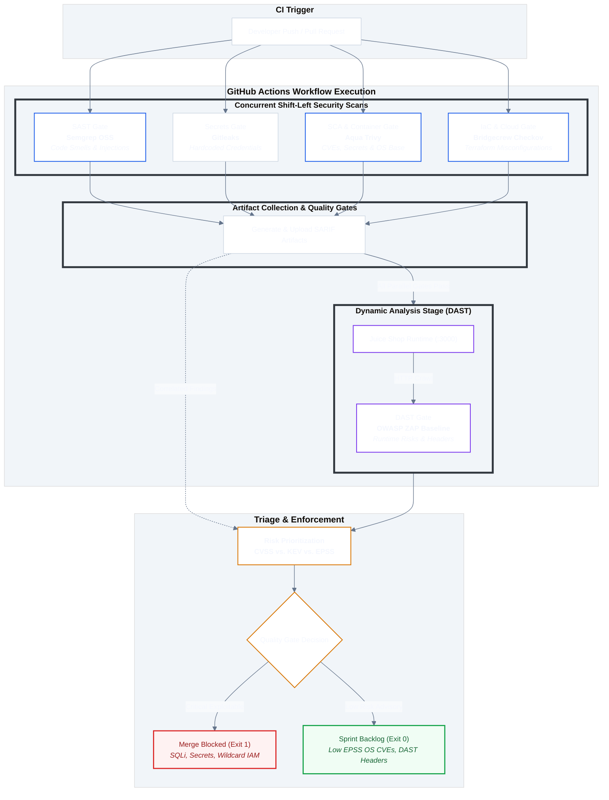

#  OWASP Juice Shop

## Automated AppSec & CloudSec CI/CD Pipeline

Enterprise-ready DevSecOps pipeline implemented on GitHub Actions targeting OWASP Juice Shop and cloud infrastructure declarations (Terraform). The pipeline enforces a Shift-Left methodology across Static Application Security Testing (SAST), Software Composition Analysis (SCA), Infrastructure as Code (IaC), Container Security, and Dynamic Application Security Testing (DAST).

---

## 1. Pipeline Architecture

The pipeline orchestrates automated security gates concurrently across ephemeral Ubuntu runners:



* **SAST (Static Application Security Testing):** Semgrep inspecting TypeScript/JavaScript source code to detect injection flaws, prototype pollution, and insecure ORM calls.
* **Secrets Scanning**: Gitleaks traversing the full `git` history to detect hardcoded API keys, RSA private keys, and high-entropy credential leakage prior to repository integration.
* **SCA & Container Security:** Aqua Trivy scanning filesystem dependencies (`package.json`, `package-lock.json`), hardcoded secrets in repository assets, and the underlying container base image (`debian`).
* **IaC & Cloud Security:** Bridgecrew Checkov auditing AWS Terraform declarations (`terraform/`) for misconfigurations against CIS Benchmarks, NIST SP 800-53, and AWS Well-Architected Security Pillars.
* **DAST (Dynamic Application Security Testing):** OWASP ZAP Baseline Scan executing active runtime discovery against the live application container on `http://localhost:3000`.

## 2. Findings Matrix & Remediation Summary

|**Gate**|**Tool**|**Target / Asset**|**Primary Finding**|**Check / Rule ID**|**Max Severity**|**Triage Status**|
|---|---|---|---|---|---|---|
|**SAST**|Semgrep|`src/routes/login.ts`|Raw Sequelize SQL Injection|`sequelize-injection-express`|**Critical**|True Positive (Critical)|
|**Secrets**|Gitleaks|`src/lib/insecurity.ts`|Hardcoded RSA Private Key|`rsa-private-key`|**Critical**|True Positive (Critical)|
|**SCA**|Trivy|`package.json` (`jsonwebtoken:0.1.0`)|Alg "None" Signature Bypass|`CVE-2015-9235`|**Critical**|True Positive (High Priority)|
|**Container**|Trivy|`debian` (Container Base Image)|Heap Buffer Overflow in `glibc`|`CVE-2026-18374`|**Medium**|True Positive (Low Risk)|
|**IaC**|Checkov|`terraform/main.tf`|Public Read Access Allowed on S3|`CKV_AWS_20` / `CKV2_AWS_6`|**High**|True Positive (Critical)|
|**IaC**|Checkov|`terraform/main.tf`|Full Wildcard Administrator Policy|`CKV_AWS_1` / `CKV_AWS_62`|**Critical**|True Positive (Critical)|
|**IaC**|Checkov|`terraform/networking.tf`|Unrestricted Ingress SSH (`0.0.0.0/0:22`)|`CKV_AWS_24`|**High**|True Positive (High Priority)|
|**DAST**|OWASP ZAP|`http://localhost:3000`|Missing `Content-Security-Policy` Header|Alert ID `10038`|**Medium**|True Positive (Moderate)|

## 3. Real-World Risk Prioritization: CVSS vs. CISA KEV vs. EPSS

Relying exclusively on CVSS results in alert fatigue: CVSS quantifies theoretical severity under isolated lab assumptions, but fails to indicate real-world exploitation in the wild.

In this pipeline, remediation velocity is prioritized across three operational tiers:

* **CVSS v3.1:** Theoretical severity score (0.0 - 10.0).
* **EPSS:** Statistical probability of weaponized exploitation in the wild within 30 days.
* **CISA KEV:** Catalog of actively exploited vulnerabilities in adversary campaigns.

### Comparative Triage Table

| **CVE / Finding** | **Affected Component** | **CVSS v3** | **EPSS Score** | **In CISA KEV?** | **Remediation Priority** | **Technical Justification** |
| :--- | :--- | :---: | :---: | :---: | :---: | :--- |
| **CVE-2015-9235** | `jsonwebtoken:0.1.0` (App SCA) | **9.8** (Critical) | **82.3%** | **NO** | **P1 (High / Block)** | Turnkey algorithm "none" signature bypass reachable via unauthenticated HTTP endpoints. High EPSS probability warrants an immediate merge block (`Exit 1`). |
| **Wildcard IAM (`*:*`)** | `terraform/main.tf` (IaC) | **9.1** (Critical) | *N/A (IaC)* | *N/A* | **P1 (High / Block)** | Full administrative takeover of AWS account upon container escape. Architectural blast radius enforces hard pipeline break (`Exit 1`). |
| **CVE-2026-18374** | `glibc` / Debian Base (OS) | **4.9** (Medium) | **0.15%** | **NO** | **P3 (Backlog / Pass)** | Heap buffer overflow in `fopen` requiring local execution with unvalidated inputs. Negligible exploit probability; triaged to scheduled backlog (`Exit 0`). |

**Key Rule of Thumb:** A vulnerability with CVSS 7.5 listed in CISA KEV or with an EPSS > 50% takes precedence over a CVSS 9.0 alert that lacks public exploits and runtime exposure.

## 4. In-Depth Technical Triage & Remediations

### 4.1 SAST: SQL Injection in Authentication Endpoint

* **Rule ID:** `javascript.sequelize.security.audit.sequelize-injection-express.express-sequelize-injection`
* **File:** `src/routes/login.ts`
* **Root Cause:** Untrusted user input (`req.body.email`) is concatenated directly into an unsanitized raw SQL execution string, enabling authentication bypass using standard payload sequences (`' OR 1=1 --`).
* **Vulnerable Pattern:**

    ```TypeScript
    models.sequelize.query(
      `SELECT * FROM Users WHERE email = '${req.body.email || ''}' AND password = '${security.hash(req.body.password || '')}' AND deletedAt IS NULL`,
      { model: models.User, plain: true }
    )
    ```

* **Remediation:** Enforce parameter binding using Sequelize named replacements:

    ```TypeScript
    // SECURE FIX
    models.sequelize.query(
      'SELECT * FROM Users WHERE email = :email AND password = :password AND deletedAt IS NULL',
      {
        replacements: { 
          email: req.body.email || '', 
          password: security.hash(req.body.password || '') 
        },
        model: models.User,
        plain: true
      }
    );
    ```

### 4.2 IaC: Cloud Infrastructure Misconfigurations (AWS Terraform)

#### A. S3 Public Access Allowed (`CKV_AWS_20` / `CKV2_AWS_6`)

* **File:** `terraform/main.tf`
* **Root Cause:** S3 bucket `app_backups` sets `acl = "public-read"` without enforcing account-level or bucket-level Public Access Blocks.
* **Remediation:** Enforce strict public access blocking and default encryption:

    ```Terraform
    # SECURE FIX: S3 Public Access Block
    resource "aws_s3_bucket_public_access_block" "secure_app_bucket" {
      bucket = aws_s3_bucket.app_backups.id
    
      block_public_acls       = true
      block_public_policy     = true
      ignore_public_acls      = true
      restrict_public_buckets = true
    }
    ```

#### B. Wildcard Administrator IAM Policy (`CKV_AWS_1` / `CKV_AWS_62`)

* **File:** `terraform/main.tf`
* **Root Cause:** The attached IAM policy grants `Action: "*"` across `Resource: "*"`, violating the Principle of Least Privilege and creating full account takeover risk.
* **Remediation:** Scope policy permissions strictly to the exact required service actions and target ARNs:

    ```Terraform
    # SECURE FIX: Least Privilege Scoped Policy
    resource "aws_iam_policy" "scoped_workload_policy" {
      name        = "${var.project_name}-scoped-policy"
      description = "Scoped policy granting read-only access to specific backup bucket"
    
      policy = jsonencode({
        Version = "2012-10-17"
        Statement = [
          {
            Sid      = "ScopedS3ReadAccess"
            Effect   = "Allow"
            Action   = [
              "s3:GetObject",
              "s3:ListBucket"
            ]
            Resource = [
              aws_s3_bucket.app_backups.arn,
              "${aws_s3_bucket.app_backups.arn}/*"
            ]
          }
        ]
      })
    }
  ```

#### C. Unrestricted Ingress SSH (`CKV_AWS_24`)

* **File:** `terraform/networking.tf`
* **Root Cause:** Inbound rule on port 22 allows `0.0.0.0/0`, exposing administrative interfaces to automated internet-wide credential brute-force attacks.
* **Remediation:** Eliminate public CIDRs; route administrative sessions through an internal VPN, a dedicated bastion CIDR, or utilize **AWS Systems Manager (SSM) Session Manager**:

```Terraform
    # SECURE FIX: Restrict to authorized internal bastion CIDR
    ingress {
      description = "Bastion-only SSH access"
      from_port   = 22
      to_port     = 22
      protocol    = "tcp"
      cidr_blocks = ["10.0.10.50/32"] # Authorized Bastion Host
    }
  ```

### 4.3 DAST: Missing Content Security Policy (OWASP ZAP Alert ID 10038)

* **Target:** `http://localhost:3000`
* **Root Cause:** Server responses lack the `Content-Security-Policy` header, leaving client browsers without origin boundaries against Cross-Site Scripting (XSS) and data exfiltration.
* **Remediation:** Integrate `helmet` in the Express application bootstrap:

  ```TypeScript
    import helmet from 'helmet';
    
    app.use(
      helmet.contentSecurityPolicy({
        directives: {
          defaultSrc: ["'self'"],
          scriptSrc: ["'self'", "'trusted-scripts.com'"],
          objectSrc: ["'none'"],
          upgradeInsecureRequests: []
        }
      })
    );
    ```

## 5. CI/CD Architecture Trade-offs & DAST Execution

By default, the `dast-zap` job deploys the pre-built, production-ready container image (`bkimminich/juice-shop`) to run runtime scans.

### Execution Trade-off Analysis

Full compilation of OWASP Juice Shop from source involves compiling TypeScript (`routes/`, `lib/`), bundling Angular frontend assets, and building native C++ SQLite bindings (`sqlite3`). This process introduces **8 to 12 minutes** of runner overhead per CI run.

Using the pre-built baseline image keeps the full multi-stage pipeline running in **under 2 minutes** while accurately evaluating dynamic attack surfaces (security headers, CSP directives, cookie attributes, and endpoint exposure).

#### Testing Local Code Modifications in DAST

If you introduce functional runtime patches to backend routes or middleware and need DAST to dynamically test those local modifications rather than the baseline image, replace the container execution step in `.github/workflows/security-pipeline.yml`:

```Diff
-     - name: Start Juice Shop Container (Optimized Baseline)
-       run: |
-         docker run -d --name juice-shop -p 3000:3000 bkimminich/juice-shop
-         timeout 60s bash -c 'until curl -s http://localhost:3000; do sleep 3; done'
+     - name: Build and Run Local Docker Image
+       run: |
+         docker build -t juice-shop:local .
+         docker run -d --name juice-shop -p 3000:3000 juice-shop:local
+         timeout 120s bash -c 'until curl -s http://localhost:3000; do sleep 3; done'
```

### 6. Tiered Quality Gates & Enforcement Policy

To strike an optimal balance between rigorous security baselines and developer velocity, the pipeline enforces a tiered enforcement model:

* **Hard Blocking Quality Gate (IaC via Checkov):**
  Enforces `exit 1` without tolerance for regressions on critical cloud misconfigurations. The job evaluates targeted checks (`CKV_AWS_1`, `CKV_AWS_62`, `CKV_AWS_24`, `CKV_AWS_20`). Any introduction of unrestricted ingress SSH (`0.0.0.0/0:22`), wildcard administrator IAM policies (`*:*`), or public S3 bucket policies halts the build and blocks the pull request merge. As the Terraform configuration is fully remediated, this gate passes cleanly in production.

* **Soft Advisory Gates (Semgrep, Gitleaks, Trivy, OWASP ZAP):**
  Operating in continuous discovery and telemetry collection mode (`continue-on-error: true` / `fail_action: false`), static code flaws, hardcoded secrets, third-party CVEs, and missing runtime security headers are parsed and exported as SARIF/CLI artifacts. Rather than blocking daily integration on an intentionally vulnerable application target, these findings are channeled directly into vulnerability triage and sprint backlog planning.
